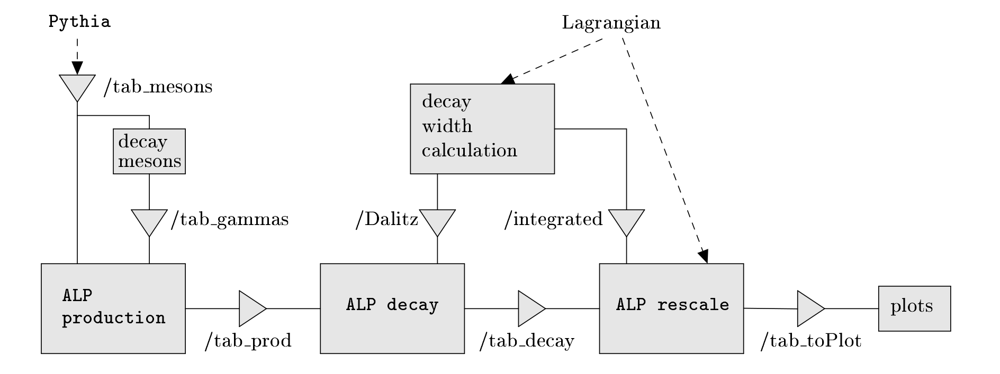

ALPINIST: Axion-Like Particles In Numerous Interactions Simulated and Tabulated
===============================================================================

ALPINIST is a framework used for the simulation of axion-like particle production and decay at beam-dump experiments and the interpretation of the results for the given model.

The framework comprises of several modules each of which reads, processes and writes tabulated data. The modules are used in the order sketched in the following figure.

For using each module, please follow the instructions in the corresponding subdirectory.
The tabulated datasets (tab_mesons, tab_prod, tab_decay, tab_toPlot) were migrated to a separate repository and can be fetched using the fetch_tables.py script.

Citation
-----------------

This code has been published together with [arXiv:2201.05170][2201.05170], [arXiv:2303.01521][2303.01521] and [arXiv:2407.08673][2407.08673] and uses values and equations cited there.

When using this framework, please cite

- <em>ALPINIST: Axion-Like Particles In Numerous Interactions Simulated and Tabulated</em>, J. Jerhot et al., JHEP 07 (2022) 094, [arXiv:2201.05170][2201.05170].

when using for ALP reinterpretation for KOTO experiment, dark scalars and dark photons, please cite

- <em>Probing Long-lived Axions at the KOTO Experiment</em>, Y. Afik, et al., Phys.Rev.D 108 (2023) 5, 5, [arXiv:2303.01521][2303.01521].

when using for HNL interpretations, please cite

- <em>On the impact of heavy meson production spectra on searches for heavy neutral leptons</em>, J. L. Schubert, et al., JHEP 02 (2025) 140, [arXiv:2407.08673][2407.08673].

The following external software is used by this framework

- <em>An Introduction to PYTHIA 8.2</em>, T. Sjostrand et al, Comput. Phys.Commun. 191 (2015) 159, [arXiv:1410.3012][1410.3012].

- <em>Mathematica, Version 12.3.1.</em>, W. R. Inc., Champaign, IL, 2021

- <em>Root - an object oriented data analysis framework</em>, R. Brun and F. Rademakers, in AIHENP'96 Workshop, Lausane, vol. 389, pp. 81-86, 1996.

- <em>Python 3 Reference Manual</em>, G. Van Rossum and F. L. Drake,  CreateSpace, Scotts Valley,CA, 2009.

[2201.05170]: https://arxiv.org/abs/2201.05170
[2303.01521]: https://arxiv.org/abs/2303.01521
[2407.08673]: https://arxiv.org/abs/2407.08673
[1410.3012]: https://arxiv.org/abs/1410.3012v1